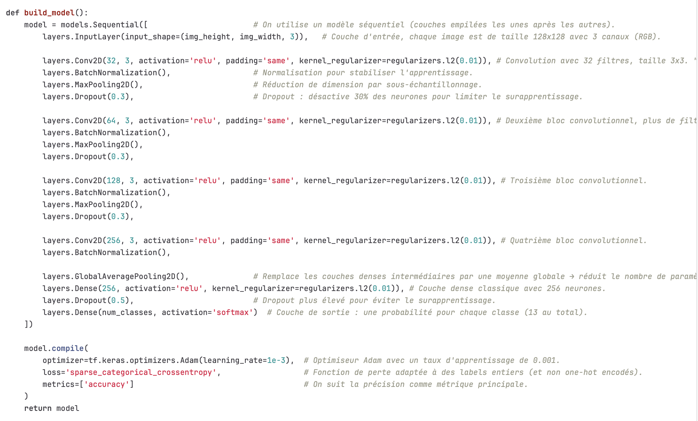
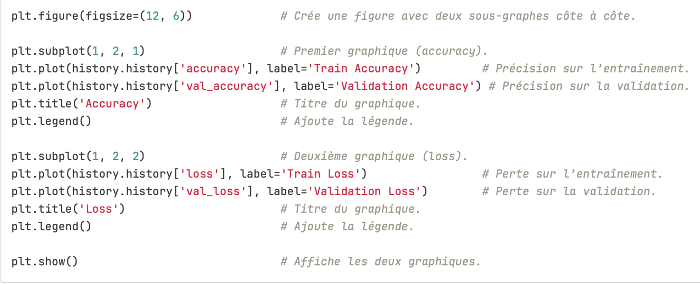
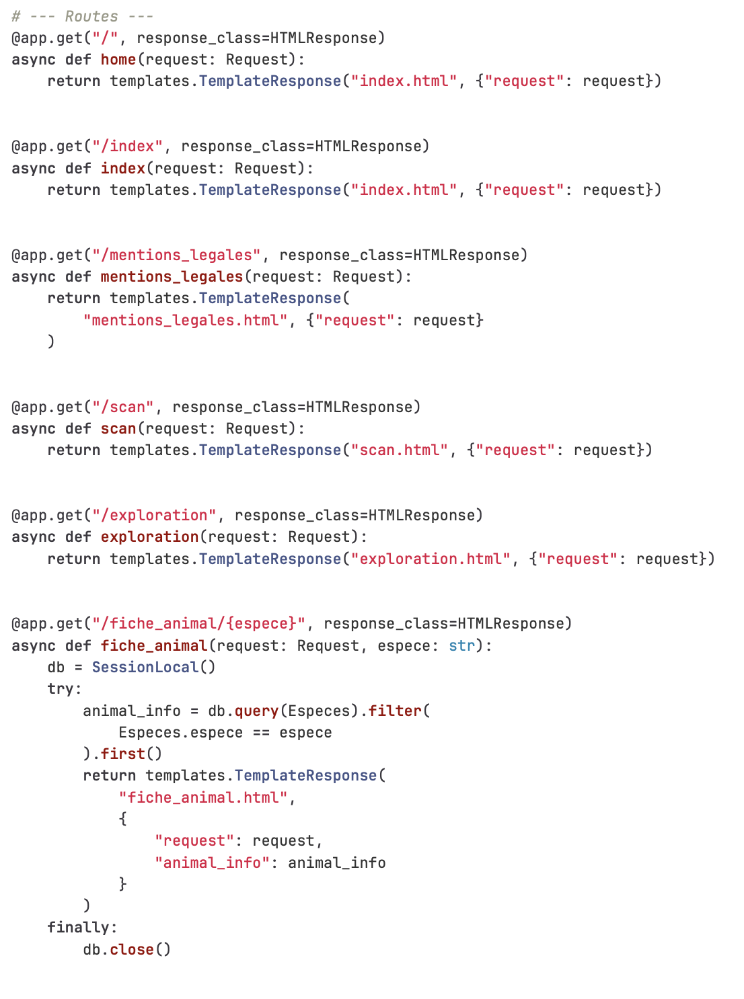
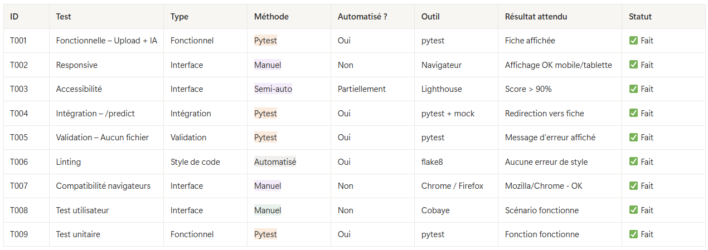

# Documentation technique

## Présentation générale du projet WildAIPrint

### Contexte

WildAIprint est une association française dédiée à la protection de la faune sauvage. Elle agit sur la sensibilisation du public à travers des campagnes organisées directement en milieu naturel.

### Objectif

Intégrer les nouvelles technologies pour renforcer l’impact de ses actions pédagogiques. Son projet phare consiste à développer une application mobile innovante permettant d’identifier les traces d’animaux dans leur habitat naturel.

### Mission

Grâce à cette application, chaque utilisateur pourra scanner une empreinte rencontrée lors d’une sortie en forêt. L’outil identifiera l’espèce correspondante et proposera des informations clés sur l’animal, son mode de vie et les enjeux liés à sa préservation. L’expérience se veut à la fois ludique, éducative et participative, afin de rapprocher le public de la biodiversité locale, tout en éveillant une conscience écologique durable.

### Réalisation attendue

Un site web qui permettra aux utilisateurs de télécharger leurs photos d’empreintes, qui seront ensuite analysées par un modèle de deep learning réseau de neurones (CNN). La solution sera également disponible à terme sur mobile.

## Organisation du travail

La méthode Agile  : 

- communication asynchrone via Notion pour
    - la répartition et le suivi de l’avancement des tâches (Kanban des étapes d’avancement de chaque tâche)
    - le rétroplanning
    - le partage des ressources et des informations utiles
- Groupe Discord
- 15 min daily chaque matin (scrum)

## Réalisation

Notre projet est composé de quatre parties :

1. le front-end (le code des pages web en HTML CSS et JS)
2. le back-end (la connexion au site avec FastAPI, la préparation des bases de données) 
3. la mise en place du modèle de reconnaissance des images (CNN); l’optimisation du code, l’amélioration des données d’entraînement du modèle 
4. la rédaction de la documentation technique du projet 

## UX-UI

L’outil principal - Figma. 

Les étapes de construction de l’interface de notre application web : 

1. la veille concurrentielle
2. la rédaction de la charte graphique 
3. la définition de nos personas
4. la construction de wireframe du site 
5. la définition de la navigation sur le site (user flow) 
6. la production des maquettes des pages web 

## Front-end

Les langages utilisés : HTML, CSS, JavaScript

## Back-end

Les langages utilisés :  Python

L’API : FastAPI

Les bases de données :  SQLite

La conteneurisation :  Docker 

Le versioning : GitLab repository 

## Bases de données

1. les données relatives au modèle de reconnaissance (252 images de 13 espèces sur Dropbox fourni avec le brief)
2. les informations complémentaires sur chaque espèce 
3. les données recueillies pour WildAIPrint (la base crée vide)

### Schéma de nos bases de données


## Modèle IA

### Sequential (les couches empilées les unes après les autres)

seed = 42



### Transfert Learning (modèle EfficientNet)

La quantité des données pour l’entraînement étant reconnue comme insuffisante et menante à risque de sur-apprentissage, mauvaise généralisation et les métriques non fiables, nous mettons en place un modèle de Transfert Learning. 


### L’entraînement du modèle (visualisation des courbes d’entraînement)



*Stratégie de l’augmentation des données (crowdsourcing, scraping contrôlé, augmentation synthétique) à mettre en place.

## FastAPI

```python
app = FastAPI()
app.mount("/static", StaticFiles(directory=STATIC_DIR), name="static")
templates = Jinja2Templates(directory=TEMPLATES_DIR)

```

Les endpoints :



## RGPD

- La demande de consentement explicite de la part de l’utilisateur avant le chargement de sa photo (page de Scan)
- Pas de collecte des données personnelles
- Une page mentions légales
- (à compléter dès l’avancement du projet)

## Environnement utilisateur (et les exigences techniques)

- Camera du téléphone/tablette/PC
- Connexion Internet suffisante pour le téléchargement d’au moins une image

## Tests

Mise en place du programme des tests de la partie back et front de l’application 



## Livrables

- Un Notebook avec l'ETL et de la modélisation
- L’application
- Le MCD / MLD / MPD
- La documentation
- Le docker du back-end
- [GitLab repository de l’application](https://gitlab.com/InaOnGit/wildaiprint-project/)